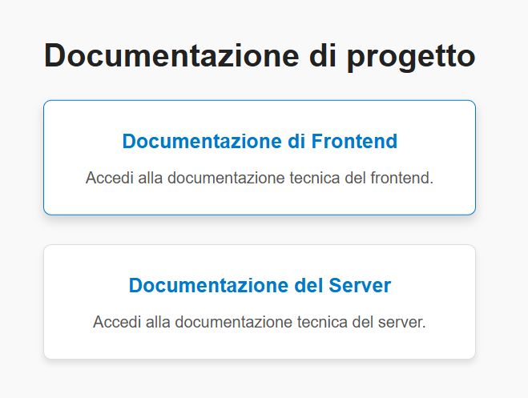

# Documentazione - Project Work 

### Introduzione  
In questo progetto è possibile trovare la documentazione del progetto [https://github.com/manfre3d/project_work](https://github.com/manfre3d/project_work) sia del frontend che del backend.  

## Come Utilizzare/Consultare la Documentazione  
1. Apri il file `index.html` nella root o recati al seguente link [https://manfre3d.github.io/project_work_docs/](https://manfre3d.github.io/project_work_docs/).  
2. Clicca sui rispettivi link per visualizzare le relative documentazioni. 
 
3. Le documentazioni di progetto per server python e frontend javascript, sono state generate rispettivamente con [sphinx](https://pypi.org/project/Sphinx/) e [jsdoc](https://www.npmjs.com/package/jsdoc).
